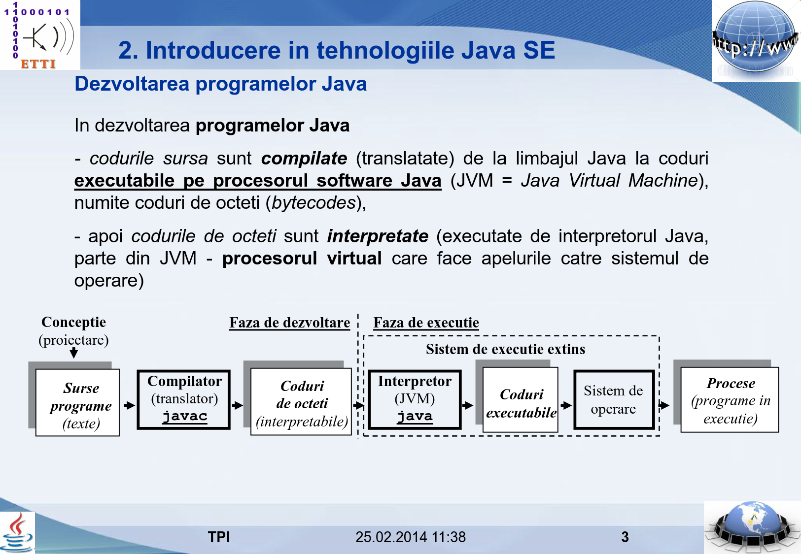
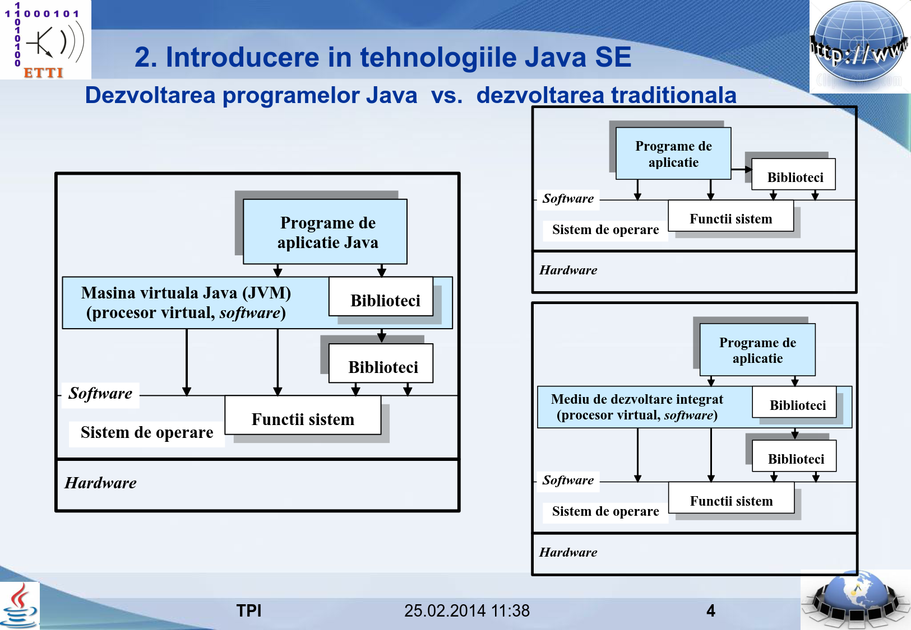

Curs 1
======

Elemente introductive. Dezvoltarea programelor Java
---------------------------------------------------

Platforme de lucru Java
-----------------------

> Limbajul de programare Java a fost folosit la dezvoltarea unor tehnologii dedicate
rezolvării unor probleme din cele mai diverse domenii. Aceste tehnologii
au fost grupate în așa numitele platforme de lucru, ce reprezintă seturi de
librării scrise în limbajul Java, precum și diverse programe utilitare, folosite
pentru dezvoltarea de aplicații sau componente destinate unei anume categorii
de utilizatori.
> -- [&#91;2&#93;][2]

### Platforma Java SE (Standard Edition)

> Este platforma standard de lucru ce oferă suport pentru crearea de
aplicații independente și appleturi.
De asemenea, aici este inclusă și tehnologia Java Web Start ce furnizează
o modalitate extrem de facilă pentru lansarea și instalarea locală a programelor
scrise în Java direct de pe Web, oferind cea mai comodă soluție
pentru distribuția și actualizarea aplicațiilor Java.
> -- [&#91;2&#93;][2]

[Arhitectura (sau componenetele) Java SE](http://www.oracle.com/technetwork/java/javase/tech/index.html)

### Platforma Java ME (Micro Edition)

> Folosind Java, programarea dispozitivelor mobile este extrem de simplă,
platforma de lucru J2ME oferind suportul necesar scrierii de programe
dedicate acestui scop.
> -- [&#91;2&#93;][2]

[Arhitectura Java ME](http://www.oracle.com/technetwork/java/embedded/javame/index.html)
[Oferta integrală pentru Java Embedded](http://www.oracle.com/technetwork/java/embedded/overview/index.html)

### Platfroma Java EE (Enterprise Edition)

> Această platformă oferă API-ul necesar dezvoltării de aplicații complexe,
formate din componente ce trebuie să ruleze în sisteme eterogene,
cu informațiile memorate în baze de date distribuite, etc.
Tot aici găsim și suportul necesar pentru crearea de aplicații și servicii
Web, bazate pe componente cum ar fi servleturi, pagini JSP, etc.
> -- [&#91;2&#93;][2]

[Arhitectura Java EE](http://www.oracle.com/technetwork/java/javaee/tech/index.html)

Spring Framework
----------------

[Arhitectura (sau proiectele) Spring Framework](https://spring.io/projects)

Exemple de websituri care folosesc Java EE/Spring
-------------------------------------------------

[Websites using Java](https://wappalyzer.com/applications/java)

Ce vom putea face noi la finele cursului cu ajutorul Java EE/Spring
-------------------------------------------------------------------

Arhitectura unei aplicații Java EE
----------------------------------

[Arhitectura aplicațiilor Java EE 7](https://docs.oracle.com/javaee/7/tutorial/overview003.htm)

### Arhitectura unei aplicații Java EE vs. aplicație PHP

[Arhitectura unei aplicații web PHP](http://skysoftwaresystem.com/technologies/php)

Servlet-uri
-----------

> Un servlet este un obiect al unei clase Java ce extinde funcționalitatea unui server care lucreaza după modelul de acces cerere-răspuns (cum este cel utilizat de protocolul HTTP, pe care se bazeaza aplicațiile Web) prin crearea unui conținut dinamic.
> 
> Un servlet Web (care adaugă funcționalitate unui server HTTP) trebuie să extindă (prin moștenire) clasa **HttpServlet** din pachetul **javax.servlet.http**.
> 
> Servlet-urile Web sunt componente care se execută intr-un container Web (Web container sau Web engine), tot așa cum applet-urile sunt executate intr-un navigator Web.
> -- [&#91;3&#93;][3]

Servere de aplicații
--------------------

[Cele mai populare servere de aplicații din anul 2016:](https://plumbr.eu/uncategorized/most-popular-java-ee-servers-2016-edition)

1. Apoache Tomcat - 58,22%
2. Jboss/WildFly - 20,22%
3. Jetty - 10.67%
4. Glassfish - 5,56%
5. Weblogic - 2,89%
6. altele - 2,44%

Ciclul de viață al servelt-uli
------------------------------

Prametri Get
------------

Delegarea execuției către alte servlet-uri și JSP-uri
-----------------------------------------------------

    RequestDispatcher view = request.getRequestDispatcher("result.jsp");
    view.forward(request, response);
    
Atribute ale cererii:

    request.setAttribute("raspuns", "Comanda a fost trimisa");
    String raspuns = request.getAttribute("raspuns");

JSP
---

[1]: http://discipline.elcom.pub.ro/tpi/Curs_TPI_21_2014_v01.pdf
[2]: https://users.info.uvt.ro/~iordan/P_III/Cristian_Frasinaru-Curs_practic_de_Java.pdf
[3]: http://discipline.elcom.pub.ro/tpi/Curs_TPI_41_v01.pdf
[4]: http://www.scritub.com/stiinta/informatica/java/Tehnologia-JSP22577.php
